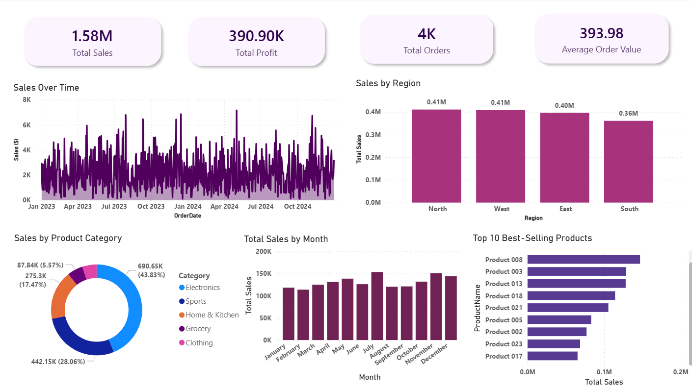

# Power BI Sales & Orders Dashboard

An end-to-end executive sales dashboard built in Power BI covering revenue trends, profitability, customer segmentation, and time-intelligence forecasting.

## Dashboard Preview

## What it does

- Tracks $1.58M total sales across 4K orders with real-time KPI cards
- Sales trend analysis from Jan 2023 to Oct 2024 with time-intelligence DAX
- Regional breakdown across North, West, East, and South territories
- Product category performance (Electronics, Sports, Home & Kitchen, Grocery, Clothing)
- Top 10 best-selling products ranked by total sales
- Monthly sales comparison with automated data refresh

## Tech Stack

- Power BI Desktop + Power BI Service
- DAX (calculated measures, time intelligence, YTD/MTD)
- SQL (data modeling, query optimization)
- Star-schema data modeling
- Automated refresh scheduling
- Row-Level Security (RLS)

## Impact

Reduced reporting turnaround time by 35% through optimized DAX measures and reusable report templates.

## Note

The .pbix file is not included due to client data confidentiality. Dashboard screenshot shows anonymized sample data.
